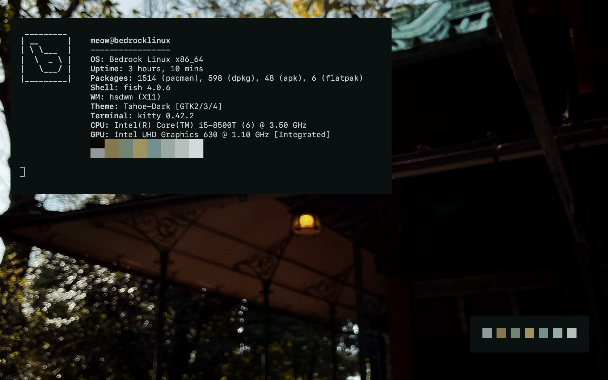

# hsdwm
itsy bitsy x11 window manager
## features

- floating + tiling (per workspace)
- master layout
- smart gaps + borders
- docks/panels support (_NET_WM_WINDOW_TYPE_DOCK, _NET_WM_STRUT_PARTIAL)
- workspace switching (1–9) + tag modes
- directional focus (h/j/k/l or arrows) 
- alt-tab cycling in current workspace
- keygrab logic (super/alt)
- all features of the wm are customizable

- super + arrows/hjkl -> focus
- super + shift + arrows/hjkl -> swap windows
- super + [1-9] -> switch workspace
- super + t -> toggle tiling/floating for current workspace
- super + Return -> spawn terminal (xterm) (default config)
- super + d -> run dmenu (default config)
- super + f -> fullscreen
- super + Tab -> alt-tab cycle

---

## configuration

edit #define values at the top of wm.c for:
- border colors/widths
- master area factor
- default gaps
- mod key (super/alt)
- terminal/dmenu commands

---

